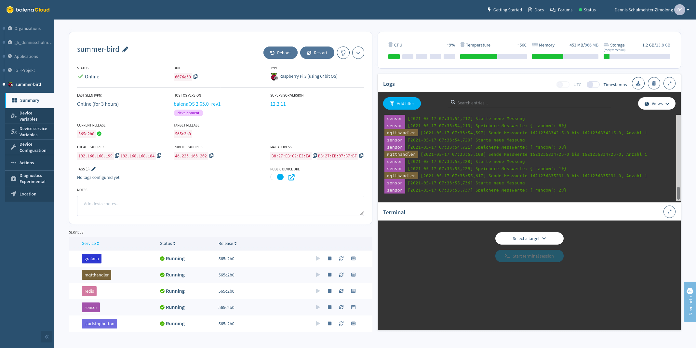

IoT-Beispielarchitektur für die Vorlesung „IoT-Technik und Geschäftsmodelle”
============================================================================

<table style="max-width: 100%;">
    <tr>
        <td>
            
        </td>
        <td>
            
        </td>
        <td>
            &nbsp;
        </td>
    </tr>
    <tr>
        <td>
            Allgemeine Sytemarchitektur
        </td>
        <td>
            Deviceseitige Systemarchitektur
        </td>
        <td>
            &nbsp;
        </td>
    </tr>
    <tr>
        <td>
            
        </td>
        <td>
            
        </td>
        <td>
            
        </td>
    </tr>
    <tr>
        <td>
            Grafana-Dashboard
        </td>
        <td>
            Balena Cloud
        </td>
        <td>
            Balena CLI (Livepush)
        </td>
    </tr>
</table>

Kurzbeschreibung
----------------

Dieses Repository enthält ein minimales Beispiel für eine moderne IoT-Architektur
bestehend aus den Softwarekomponenten für die IoT-Devices sowie das Backend.
Programmiersprache ist Python. Entwicklung, Test und Produktivsetzung sämtlicher
Komponenten erfolgen mit Docker – sowohl auf den IoT-Devices als auch im Backend.
Auf Seiten der Devices wird dies durch die **Balena Cloud** im Produktivbetrieb
bzw. das **Balena CLI** während der Entwicklung vollständig automatisiert. Die
Docker-Container des Backends können hingegen in „klassischen“ Cloudumgebungen
deployt werden.

Das Beispiel ist minimal in dem Sinne, dass nur die wichtigsten Bausteine zur
Umsetzung der Systemarchitektur enthalten sind. Der Quellcode kann daher leicht
nachvollzogen und an eigene Bedürfnisse angepasst werden. Es ist jedoch vollständig
genug, um mit wenigen Anpassungen reale Anwendungsfälle erfüllen zu können.

Die IoT-Devices umfassen folgende Komponenten:

 * `redis`: Zentraler Redis-Server
 * `sensor`: Python-Programm zum Auslesen der Sensordaten und Ablage in Redis
 * `startstopbutton`: Python-Programm zum Starten und Stoppen der Sensormessungen
 * `mqtthandler`: Python-Programm zum Versand der Sensordaten via MQTT
 * `grafana`: Lokales Grafana-Dashboard zur Überwachung der Devices

Hauptbestandteil ist hier der Redis-Server, der als strukturierter in-memory
Key-Value-Store sowohl für die lokale Zwischenspeicherung der Sensordaten als
auch die Kommunikation der Teilprogramme untereinander sorgt. Der Server ist
so konfiguriert, dass bei einem Stromausfall maximal die Daten der letzten
Sekunde verloren gehen können.

Die Sensordaten werden dabei via MQTT an das Backend sowie weitere, interessierte
Empfänger verschickt. Dabei ist sichergestellt, dass bei einem Teilausfall des
Systems keine Sensordaten verloren gehen, sondern der Sendevorgang automatisch
nachgeholt wird. Ebenso erlauben die Devices eine einfache Fernsteuerung durch
JSON-kodierte Kommandos via MQTT.

Das Backend umfasst hingegen folgende Komponenten:

 * `mqttserver`: Zentraler MQTT-Server zum Datenaustausch mit den IoT-Devices
 * `mariadb`: MariaDB (ehemals MySQL) Datenbank zur dauerhaften Sicherung der Sensorwerte
 * `receiver`: Python-Programm zum Emfpang der Sensordaten und Ablage in der Datenbank
 * `webadmin`: Webbasierte Admin-Oberfläche zur Einsicht der Sensordaten und Steuerung der Devices

**Der Serverteil ist derzeit in Arbeit und fehlt deshalb noch.**

Entwicklung der IoT-Devices
---------------------------

Das **Balena CLI** kann sämtliche Client-Komponenten auf einen lokales Entwicklerboard
(hier Rasbperry Pi) ausführen und bei Änderungen am Quellcode automatisch aktualisieren
(sog. **Livepush**). Das erstmalige Starten der Komponenten dauert lange. Dafür werden
die betroffenen Komponenten bei jeder Quellcodeänderungen innerhalb weniger Sekunden
neugestartet, so dass man fast wie lokal entwickeln kann. Die notwendigen Schritte sind
hierfür:

  1. In der Balena Cloud eine neue Anwendung registrieren
  2. Development-Version des Balena OS herunterladen und auf SD-Karte schreiben
  3. Das Entwicklerboard mit dem eben heruntergelandenen Balena OS starten
  4. In der Cloud den „Local Mode“ aktivieren
  5. Auf der Kommandozeile folgende Befehle ausführen:
      * `cd device`
      * `sudo balena scan`
      * `balena push xxxxxx.local`

`xxxxxx.local` muss hierbei durch den mit `sudo balena scan` ermittelten Hostnamen
ersetzt werden (z.B. `6076a30.local`). Alternativ kann auch die IP-Adresse des
Boards verwendet werden. Auf der Konsole werden alle Log-Ausgaben der Services und
des Devices ausgegeben. Dies kann mit `Strg+C` beendet werden. Das Device läuft
allerdings weiter.

Folgende Befehle können bei der Entwicklung nützlich sein:

 * `balena logs xxxxxx.local`:  
   Wiederaufnahme der Log-Ausgabe in der Konsole

 * `balena logs xxxxxx.local --service sensor --service mqtthandler`:  
   Konsolenausgabe auf einzelne Services einschränken

* `balena ssh xxxxxx.local`:  
  SSH-Verbindung zum Hostsystem des Devices herstellen

* `balena ssh xxxxxx.local mqtthandler`:  
  SSH-Verbindung zu einem Containersystem des Devices herstellen

Produktivsetzung der IoT-Devices
--------------------------------

Zur Produktivsetzung der Devices muss in der Cloud der „Local Mode” deaktiviert
werden (in den Geräteeinstellungen des Entwicklerboards). Anschließend kann das
Device wieder über die Balena Cloud verwaltet und konfiguriert werden. Das
eigentliche Deployment erfolgt mit folgendem Befehl:

`balena push IoT-Projekt`

Die Bezeichnung `IoT-Projekt` muss dabei durch den tatsächlichen Namen der Anwendung
innerhalb der Balena Cloud ersetzt werden. Innerhalb der Cloud kann das Verhalten
der Devices über verschiedene Umgebungsvariablen beeinflusst werden. Eine Auflistung
findet sich in den README-Dateien und den Konfigurationsdateien der einzelnen
Komponenten.

Entwicklung des Backends
------------------------

Die Backendkomponenten können zum Test mit **Docker Compose** lokal gestartet
werden. Zum Beispiel mit folgenden Befehlen:

 * `docker-compose up`:  
 Starten aller Backend-Services

 * `docker-compose down`:  
 Stoppen aller Backend-Services

Produktivsetzung des Backends
-----------------------------

Die Docker-Container können in einer beliebigen Cloud-Container-Umgebung deployed
werden. In der Regel muss dann die Adresse des MQTT-Servers in der Device-Konfiguration
durch setzen der entsprechenden Umgebungsvariablen in der Balena Cloud angepasst
werden. Denn standardmäßig wird der öffentliche, nicht gesicherte Sandboxserver
`broker.hivemq.com` verwendet, was zum Testen schön aber für die Produktivsetzung
ein No-Go ist.

Copyright
---------

Sämtliche Quellcodes sind lizenziert unter
[_Creative Commons Namensnennung 4.0 International_](http://creativecommons.org/licenses/by/4.0/)

© 2021 Dennis Schulmeister-Zimolong  

E-Mail: [dhbw@windows3.de](mailto:dhbw@windows3.de)  
Webseite: https://www.wpvs.de