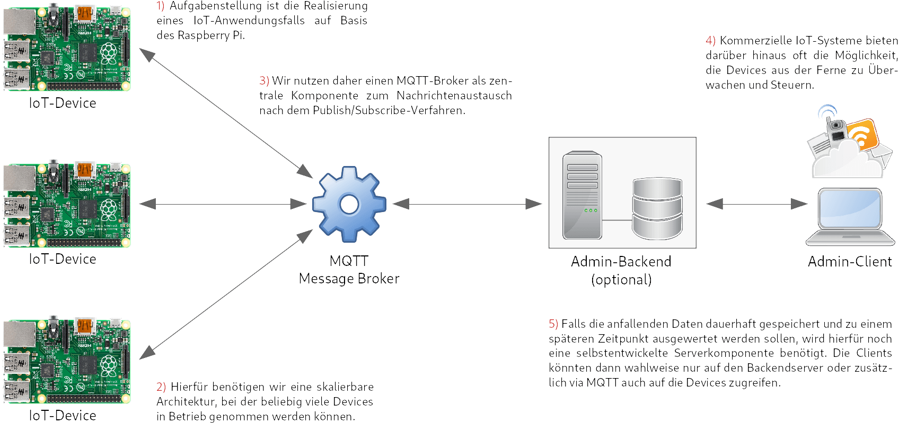
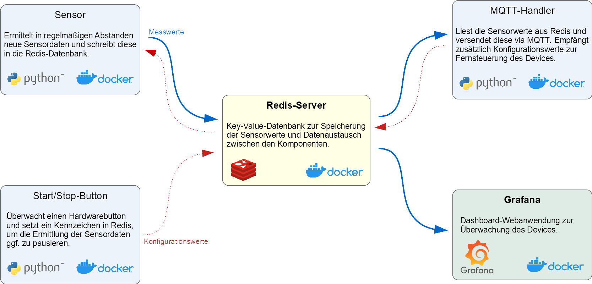
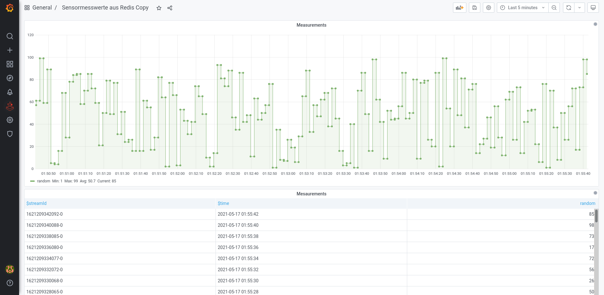
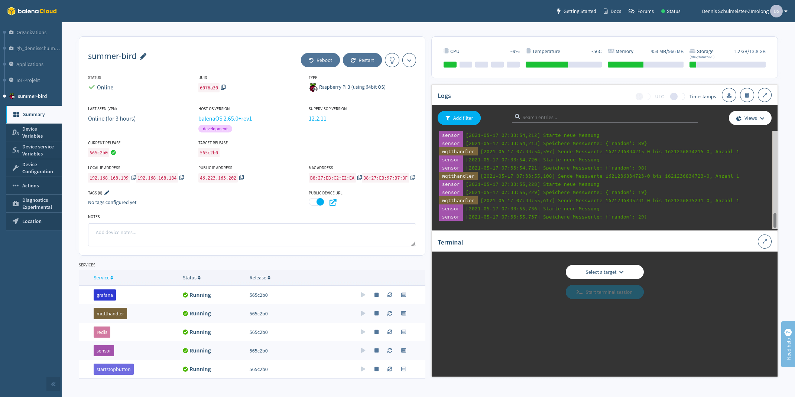
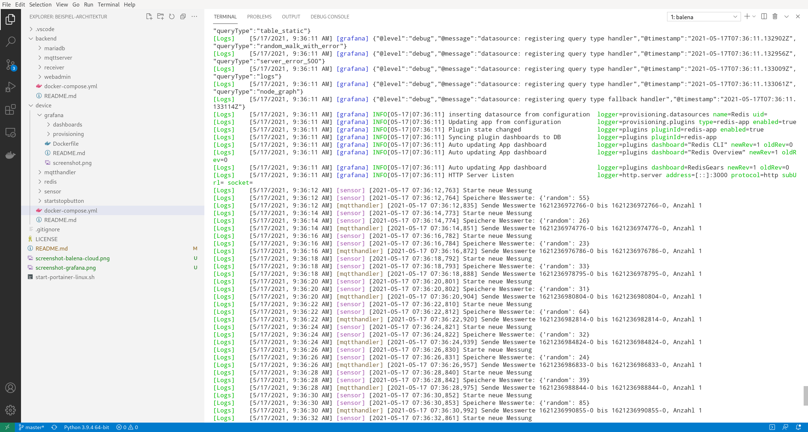

# Smart-Security (Ein Projekt der Vorlesung "IoT-Technik und Geschäftsmodelle")

<table style="max-width: 100%;">
    <tr>
        <td>
            
        </td>
        <td>
            
        </td>
        <td>
            &nbsp;
        </td>
    </tr>
    <tr>
        <td>
            Allgemeine Sytemarchitektur
        </td>
        <td>
            Deviceseitige Systemarchitektur
        </td>
        <td>
            &nbsp;
        </td>
    </tr>
    <tr>
        <td>
            
        </td>
        <td>
            
        </td>
        <td>
            
        </td>
    </tr>
    <tr>
        <td>
            Grafana-Dashboard
        </td>
        <td>
            Balena Cloud
        </td>
        <td>
            Balena CLI (Livepush)
        </td>
    </tr>
</table>

## Kurzbeschreibung

Dies ist das Repository des Projektes "Smart-Security", einem smarten Alarmsystem.
Das Projekt ist in folgende Softwarekomponenten gegliedert:

- backend
  - enthält alle Services, die serverseitig (backendseitig) ausgeführt werden. Für mehr Informationen siehe auch [backend readme](backend/README.md)
  - die Backend Docker-Container können in jeder beliebigen Docker-Engine ausgeführt werden
- device
  - enthält alle Services, die deviceseitig (bspw. RaspberryPi) ausgeführt werden. Für mehr Informationen siehe auch [device readme](device/README.md)
  - das Deployment erflogt über die Balena-Cloud
- misc
  - enthält alles, was nicht zum Backend oder der Deviceseite gehört, bspw. Bilder für diese Readme

## Entwicklung der IoT-Devices

Das **Balena CLI** kann sämtliche Client-Komponenten auf einen lokales Entwicklerboard
(hier Rasbperry Pi) ausführen und bei Änderungen am Quellcode automatisch aktualisieren
(sog. **Livepush**). Das erstmalige Starten der Komponenten dauert lange. Dafür werden
die betroffenen Komponenten bei jeder Quellcodeänderungen innerhalb weniger Sekunden
neugestartet, so dass man fast wie lokal entwickeln kann. Die notwendigen Schritte sind
hierfür:

  1. In der Balena Cloud eine neue Anwendung registrieren
  2. Development-Version des Balena OS herunterladen und auf SD-Karte schreiben
  3. Das Entwicklerboard mit dem eben heruntergelandenen Balena OS starten
  4. In der Cloud den „Local Mode“ aktivieren
  5. Auf der Kommandozeile folgende Befehle ausführen:
      * `cd device`
      * `sudo balena scan`
      * `balena push xxxxxx.local`

`xxxxxx.local` muss hierbei durch den mit `sudo balena scan` ermittelten Hostnamen
ersetzt werden (z.B. `6076a30.local`). Alternativ kann auch die IP-Adresse des
Boards verwendet werden. Auf der Konsole werden alle Log-Ausgaben der Services und
des Devices ausgegeben. Dies kann mit `Strg+C` beendet werden. Das Device läuft
allerdings weiter.

Folgende Befehle können bei der Entwicklung nützlich sein:

 * `balena logs xxxxxx.local`:  
   Wiederaufnahme der Log-Ausgabe in der Konsole

 * `balena logs xxxxxx.local --service sensor --service mqtthandler`:  
   Konsolenausgabe auf einzelne Services einschränken

* `balena ssh xxxxxx.local`:  
  SSH-Verbindung zum Hostsystem des Devices herstellen

* `balena ssh xxxxxx.local mqtthandler`:  
  SSH-Verbindung zu einem Containersystem des Devices herstellen

## Produktivsetzung der IoT-Devices

Zur Produktivsetzung der Devices muss in der Cloud der „Local Mode” deaktiviert
werden (in den Geräteeinstellungen des Entwicklerboards). Anschließend kann das
Device wieder über die Balena Cloud verwaltet und konfiguriert werden. Das
eigentliche Deployment erfolgt mit folgendem Befehl:

`balena push smart-security`

## Raspberry Pi Sensoren und Aktoren

Für die GPIO-Belegung siehe entsprechenden [wiki-Eintrag](https://github.com/Phape/smart-security/wiki/Raspberry-Pi-GPIO-Belegung).

Zigbee-Geräte werden via MQTT eingebunden. Mehr dazu im [wiki](https://github.com/Phape/smart-security/wiki/Zigbee) und im [Blog-Eintrag "Zigbee mit dem Raspi"](https://www.iot-embedded.de/iot-2021/smart-security/zigbee-mit-dem-raspi/)

## Entwicklung des Backends

Die Backendkomponenten können zum Test mit **Docker Compose** lokal gestartet
werden. Zum Beispiel mit folgenden Befehlen:

 * `docker-compose up`:  
 Starten aller Backend-Services

 * `docker-compose down`:  
 Stoppen aller Backend-Services

## Produktivsetzung des Backends

Die Docker-Container können in einer beliebigen (Cloud-)Container-Umgebung deployed
werden.

## Copyright

Sämtliche Quellcodes sind lizenziert unter
[_Creative Commons Namensnennung 4.0 International_](http://creativecommons.org/licenses/by/4.0/)

© 2021 Dennis Schulmeister-Zimolong  

E-Mail: [dhbw@windows3.de](mailto:dhbw@windows3.de)  
Webseite: https://www.wpvs.de